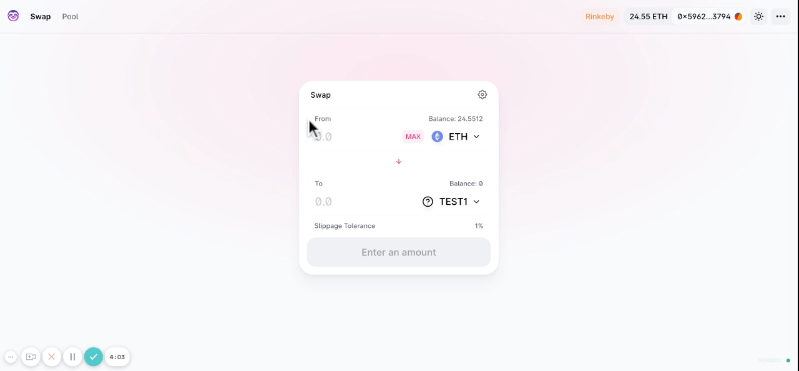

# SlowSwap Interface (originally forked from Uniswap)

SlowSwap is an AMM with a VDF that prevents MEV front-running and sandwiching. User will generate a vdf on the front-end, serving as proof of work, which will then be passed in as a parameter when invoking the swapping contract.



This project was built during EthDenver 2022. You can find a live product [here](https://app.slowswap.io/).

## Development

### Install Dependencies

```bash
yarn install
```

### Run

```bash
yarn start
```

## Social

- Website: [slowswap.io/](https://slowswap.io//)
- Interface: [app.slowswap.io/](https://app.slowswap.io/)
- Twitter: [@SlowSwap](https://twitter.com/SlowSwap)
- Telegram: [t.me/+QTXuENYiHg80N2Zh](https://t.me/+QTXuENYiHg80N2Zh)
- Discord: [SlowSwap](https://discord.gg/j3WzFtDZZc)
